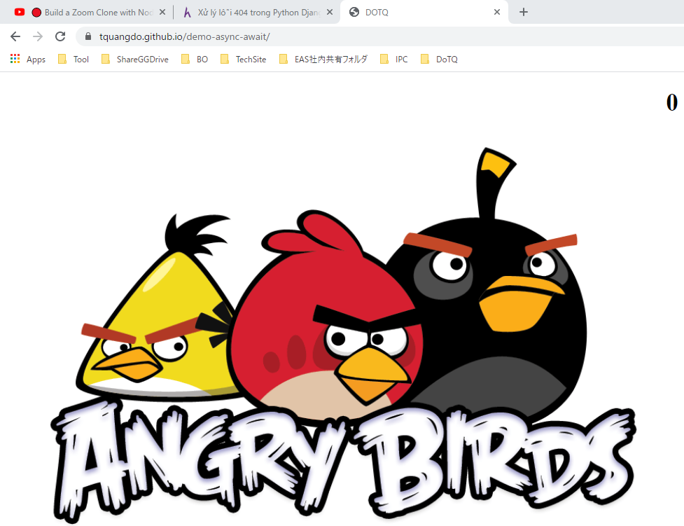

# js-demo-async-await 🧨🚀

## deploy local
run "index.html" on browser

## src code
- src code of "https://tquangdo.github.io/js-demo-async-await/" are only: `index.html` & `index.js`
- `test.js` is just for testing the order of console.log when using `promise, async & await`
